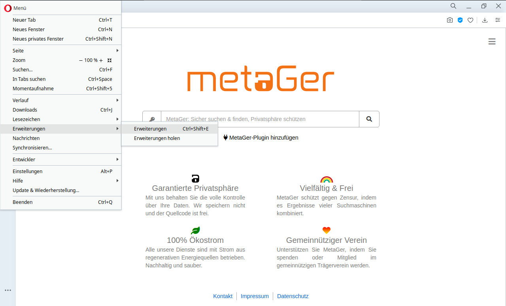
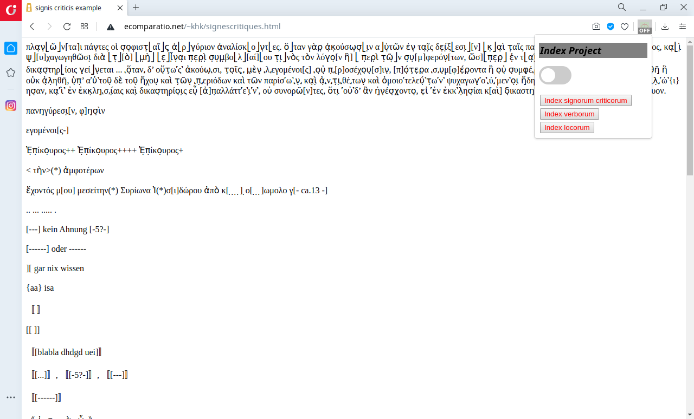
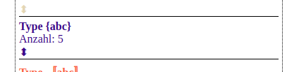
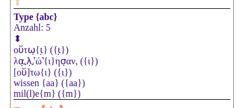
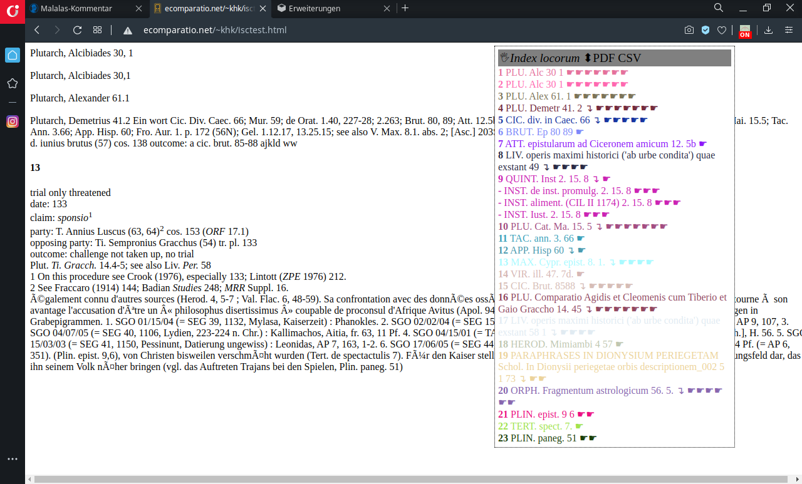

# CBE Index project

A cross browser extension (cbe) to extract a *Index signorum criticorum* (ISC), *Index verborum* (IV) and *Index locorum* (IL) from any webpage. A cross browser extension has the advantage to get access to the data of more than one webpage at a time and to have the JS language at hand, all combined into the browser  as host and interface. The index projket cbe offeres the feature of comparing indices.

# Installation

## Extension store

The cbe is (at the moment) not available through a browser extension store. A next version of the software will be. But this version is for early testers.

## Chrome / Chromium

Use the Chrome menu to install it as a extracted extension. Choose src Folder of downloaded gitrepository.
Go to *Menu* > *Weitere Tools (Other Tools)* > *Erweiterungen (Extensions)*. 

Activate the *Entwicklermodus (Developermode)* and select *Entpackte Erweiterung laden (load extracted extension)* and choose src-folder of the location you extracted the cbe to.

Done.

## Opera

Use the Opera menu to install the cbe from the extracted github repository download. Go to *Menu* > *Erweiterungen (Extensions)* > *Erweiterungen (Extensions)* or hit Ctrl+Shift+E.

Activate the *Entwicklermodus (Developermode)* and select *Entpackte Erweiterung laden (load extracted extension)* and choose src-folder of the location you extracted the cbe to.

Done.

## Firefox

## Safari

# Data extraction fom webpage
A crusial internal feature of the software is the content-extraction from a webpage. There are two modi of operation of the cbe. The first one extractes the string content from a page by determing the HTML-elements containing the most unstruktured text. The second one lets the user select the text that need to be processes. If the first modus fails the second one can be used.

# Index signorum criticorum

What is a *Index signorum criticorum*: It is a index, like the *Index verborum*, *Index locorum* or *Index rerum*, but for all signes used in the critical edition of classical texts, fragments, inscriptions, papyri and ostraca. 

## Usage
After installing the cbe to your browser, you have to turn the cbe on.

If you navigate to a webpage the cbe adds a *Index signorum criticorum* after clicking the button in the cbe popup-menu. You can interact with shown index, print it and if you open another webpage the index of the first and the next page is compared in terms of set comparison.

There is a testpage, that contains all signes:

http://ecomparatio.net/~khk/signescritiques.html

### Main Menu

The index has a small main menu at the top of the displayed box. You can freely drag the box around and arrange it to your needs (*hand sign*). You can shorten the whole box to the main menu (⬍). You can get a PDF/print of the index in its current state (if selections have been made they will occur in the PDF).

### A index entry

The index is of variable length, it shows just singe types that occur on the webpage. Every entry shows the type (mouse over for description), the number of occurrence and a ⬍ button.

If you click ⬍ you get a list of all places of occurrence.

### The set comparison

If you have opened more webpages (tabs) in your browser to the same time, every index entry provides a comparison. After the arrow there is the total count of occurrence. If you click on this you open the page, if you just do a mouse-over you can see the URL displayed. Next there are up to three colored bars. If you have 3 than the first are the places that are unique in this webpage, the second bar are the places common to this and the other webpage and the third bar are the places unique to the other page. The mouse-over for each bar provides the places, the count and a description.

## Signes recognized

### EINZELBUCHSTABEN ZEICHEN

*ẹ*, Def: Unterpunkt, Lesung unsicher; aus dem Kontext erschlossen, Buchstaben, die derart beschädigt sind, daß sie nur im Kontext sicher identifiziert werden können.

*e̲*, Def: Buchstaben, die von früheren Gewährsmännern gelesen und abgeschrieben wurden, aber später verlorengegangen sind.
   
*c̅*, Def: Besondere Buchstabenformen und Zahlen; Abkürzungen/Abbreviaturen in mittelalterlichen Handschriften.

*+++*, Def: Spuren von Buchstaben, die derart in Mitleidenschaft gezogen sind, daß sie nicht identifiziert werden können."

*...*, Def: Punktserie, Litterarum vestigia.

### LÜCKEN ALLER ART

*[abc]*, Def: Buchstaben, die infolge einer zufaelligen Beschaedigung der Oberfläche voellig verschwunden oder am Rande weggebrochen sind und die der Herausgeber ergaenzt hat.

*[abc-]*, Def: Buchstaben, die infolge einer zufälligen Beschädigung der Oberfläche völlig verschwunden oder am Rande weggebrochen sind und die der Herausgeber ergänzt hat, doch ist die Deklinations- oder Konjugationsform unsicher; wird auch gesetzt, wenn die Wurzel eines Wortes sicher, aber das aus dieser Wurzel abgeleitete Wort unsicher ist, außerdem wenn im Falle einer möglichen Abkürzung eines Wortes unbekannt ist, wieviele Buchstaben des Wortes ausgeschrieben waren.

*[...]*, Def: Buchstaben, die infolge einer zufälligen Beschädigung der Oberfläche völlig verschwunden oder am Rande weggebrochen sind und die der Herausgeber nicht ergänzen konnte, obwohl sich ihre Anzahl sicher berechnen läßt; für jeden Buchstaben wird ein Punkt gesetzt.

*[-ca.16 -]*, Def: Unbestimmte Lücke, vermutete Anzahl von Buchstaben der Lücke in einer Zeile.

*[---]*, Def: Unbestimmte, unerkennbare Länge einer Lücke in einer Zeile. Buchstaben, die infolge einer zufälligen Beschädigung der Oberfläche völlig verschwunden oder am Rande weggebrochen sind, die der Herausgeber nicht ergänzt hat und deren Anzahl sich ungefähr oder gar nicht berechnen läßt.

*[------]*, Def: Lücke unbestimmter Länge.

*------*, Def: Lücke einer ganzen Zeile bzw. Lücke ganzer Zeilen, deren Anzahl unsicher ist.

*][*, Def: Lücke unbestimmt
  

### TILGUNG ALLER ART

*{abc}*, Def: Irrtümlich hinzugefügte Buchstaben, die der Herausgeber getilgt hat.

*〚abc〛*, Def: In der Antike getilgte Buchstaben, die trotzdem deutlich oder mit Wahrscheinlichkeit zu lesen sind.

*[[abc]]*, Def:Rasur; In der Antike getilgte Buchstaben, die trotzdem deutlich oder mit Wahrscheinlichkeit zu lesen sind.

*〚[abc] 〛*, Def: In der Antike getilgte Buchstaben, die der Herausgeber ergänzt hat.

*〚[...] 〛, 〚[-5?-] 〛, 〚[---] 〛*, Def: In der Antike getilgte Buchstaben, deren Anzahl sich sicher, weniger sicher oder gar nicht berechnen läßt.

*〚[------] 〛*, Def: Lücke einer ganzen getilgten Zeile.

### ERSATZ VON BUCHSTABEN UND LUECKEN / WIEDERHERSTELLUNG

*《abc》*, Def: Ersatz für getilgte Buchstaben, die deutlich oder mit Wahrscheinlichkeit zu lesen sind.

*⎣abc⎦*, Def: Durch den Editor wieder hergestellet.

*⌈abc⌉*, Def: Aus dem Original rekonstruiert.

*<<abc>>*, Def: Buchstaben, die anstelle getilgter Passagen eingefügt worden sind.

*<<[[]]>>*, Def: Der Text wurde zunächst getilgt und dann wieder eingemeißelt.

*<a=b>*, Def: Korrektur (Beispiel: f<e=F>cit für FFCIT).

*《[abc]》*, Def: Ersatz für getilgte Buchstaben, die infolge einer zufälligen Beschädigung der Oberfläche völlig verschwunden oder am Rande weggebrochen sind und die der Herausgeber ergänzt hat.

*《[...]》,《[-5?-]》,《[---]》*, Def: Ersatz für getilgte Buchstaben, die infolge einer zufälligen Beschädigung der Oberfläche völlig verschwunden oder am Rande weggebrochen sind und deren Anzahl sich sicher, weniger sicher oder gar nicht berechnen läßt.

### ANGABEN DES EDITORS

*(abc)*, Def: Auflösung von Abkürzungen, Abgekürztes Wort, das der Herausgeber aufgelöst hat.

*(abc-)*, Def: Abgekürztes Wort, das der Herausgeber aufgelöst hat, doch ist die Deklinations- oder Konjugationsform unsicher.

*(scil. abc)*, Def: Ein Wort, das nicht im Text steht, das aber stillschweigend zu verstehen ist und das der Herausgeber hinzugefügt hat.

*⟨------⟩,⟨---⟩,⟨------?⟩,⟨---?⟩*, Def: Unvollendete Inschrift (die Inschrift bricht entweder innerhalb der Zeile oder am Zeilenende ab; in fraglichen Fällen mit ? vor der schließenden Klammer).

*abc(---)*, Def: Abgekürztes Wort, das nicht sicher aufgelöst werden kann.

*<abc>,⟨abc⟩*, Def: Irrtümlich ausgelassene Buchstaben, die der Herausgeber hinzugefügt hat.

*(!)*, Def: Unmittelbar an ein Wort anschließend markiert (!) eine ungewöhnliche Schreibweise wie Maxumus(!); isoliert stehend markiert (!) ein fehlendes Wort wie das fehlende f(ilius) in C(aius) Iulius C(ai) (!) Maximus.

*˹abc˺*, Def: Buchstaben, die der Herausgeber korrigiert hat.

*˻abc˼*, Def: Buchstaben, die der Herausgeber unter Benutzung anderer Zeugnisse korrigiert hat.

*(vac.), (vac. 3?)*, Def: vacat; Abschnitte einer Zeile, die nicht beschrieben gewesen zu sein scheinen und deren Ausdehnung – nach der Zahl der Buchstaben, die man darin hätte unterbringen können, berechnet – sicher oder weniger sicher oder gar nicht berechnet werden kann.

*=*, Def: Worttrennung.

### ZEILEN UND SPALTEN

*/*, Def: Zeilentrenner; Zeilenende.

*/5*, Def: Zeilenende mit Numerierung.

*|*, Def: Zeilentrenner; Zeilenanfang.

*|5*, Def: Zeilenanfang mit Numerierung.

*||*, Def: Spaltenumbruch; Abtrennung von Spalten; Spaltenanfang.

# Index verborum

What is a *Index verborum*: it is a list derived from the wordforms within a string. We will also include the relations between wordforms and different types of organisation of the list. 

## Usage

After you switched the cbe on you can click the button to build a *Index verborum*. The index constits of entries showing the wordform an the count. The list is organized by wordform frequnecy. If you have multiple taps with *index verborum* additional numbers per list entry are generated shwoing the wordformfrequncy on the other pages. There is a mouse-over to show the origin link.

# Index Locorum

What is a *Index locorum*: It is a list of all refreences to classical texts. The references are more or less canonical. A reference consists of a few sigla (or full names) that could be read as author workname combinations and a view numbers (locations in the textorganisation or ranges, enumerations of both).

## Usage

After you activated the cbe and hitting the button labeled *Index locorum* you will get a list. With the hand sign in the menu you can freely drag the list around. After every entry of the list there is a little downfacing arrow, if there are alternative references, that could be constructed. There are pointing hands if the constructed reference does exist on a other open webpage.

There is a testpage http://ecomparatio.net/~khk/isctest.html

# Restrictions

## Browser compatibility
The extension is tested under the latest Chrome and Opera. Firefox is not working. See https://github.com/je-wi/cbe for a general list of cbe tested browsers.

